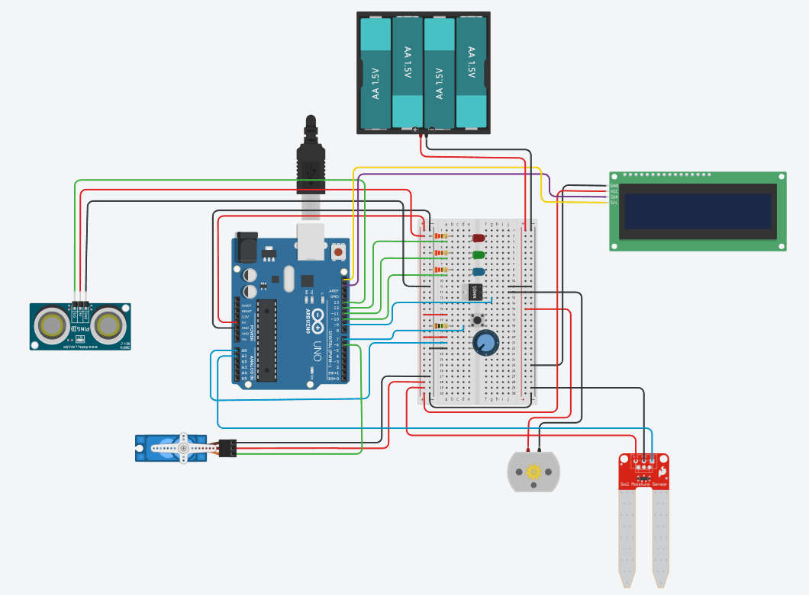

# Automatic Garden Watering System

Developed by: **Marco Aland Adinanda** (23/514817/TK/56524)  
Project for: **Industrial Automation Course**

## Overview
This is an Arduino-based Automatic Plant Watering System designed utilizing a Finite State Machine (FSM) architecture. Instead of running everything concurrently in a single loop, the system operates in one of four distinct states (screens). This ensures that the system's menu interfaces uniquely and efficiently, and the pump and water valve processes only run when in the correct authorized operational state.

## State Machine Architecture
The system routes traffic between the following active states:
1. **Home Screen (0)**: A welcome splash screen waiting for a user click to begin.
2. **Menu Screen (1)**: Allows the user to select between dynamically running the system or tuning operational settings.
3. **Operating Screen (2)**: Core automation mode. Actively monitors soil moisture and water tank distance sensors to autonomously trigger the watering pump and water refill valve.
4. **Settings Screen (3)**: Interactive interface to configure system variables using a potentiometer:
   - Valve Angle (0 - 180 deg)
   - Water Tank Refill Distance Limit
   - Soil Moisture Minimum Threshold (Triggers pump)
   - Soil Moisture Maximum Threshold (Stops pump)
   - Pump Power Output (PWM)

## Hardware Components
- **Microcontroller**: Arduino
- **Sensors**: 
  - Soil Moisture Sensor (Analog Pin A1)
  - Ultrasonic Distance Sensor (Digital Pin 13, single pin for Trigger/Echo)
- **Actuators**:
  - Water Pump Relay/MOSFET (Digital Pin 9)
  - Water Valve Servo Motor (Digital Pin 6)
- **User Interface**: 
  - 16x2 LCD Display (I2C via Adafruit_LiquidCrystal)
  - Push Button (Digital Pin 7, for selection/navigation)
  - Potentiometer (Analog Pin A0, for scrolling menus and adjusting values)
- **Indicators**:
  - System ON - Red LED (Pin 12)
  - Pump Active - Green LED (Pin 11)
  - Valve Active - Blue LED (Pin 10)

## Simulation & Documentation
You can access and interact with the system simulation on Tinkercad via the link below:

**[Tinkercad Simulation - Automatic Garden Watering System](https://www.tinkercad.com/things/eGgufICPlHm-automatic-garden-watering-system-marco-aland-adinanda?sharecode=7OscCA9osrfpMdcgZaTSY0ohgTgGznhDOqe0YbNxDQY)**

### System Visualization
Below is the system layout and visualization from Tinkercad:

### Additional Files
- **`main_arduino.ino`**: The main C++ code for the Arduino.
- **`Schematic_Diagram.pdf`**: Detailed hardware schematic diagram for wiring and setup.
